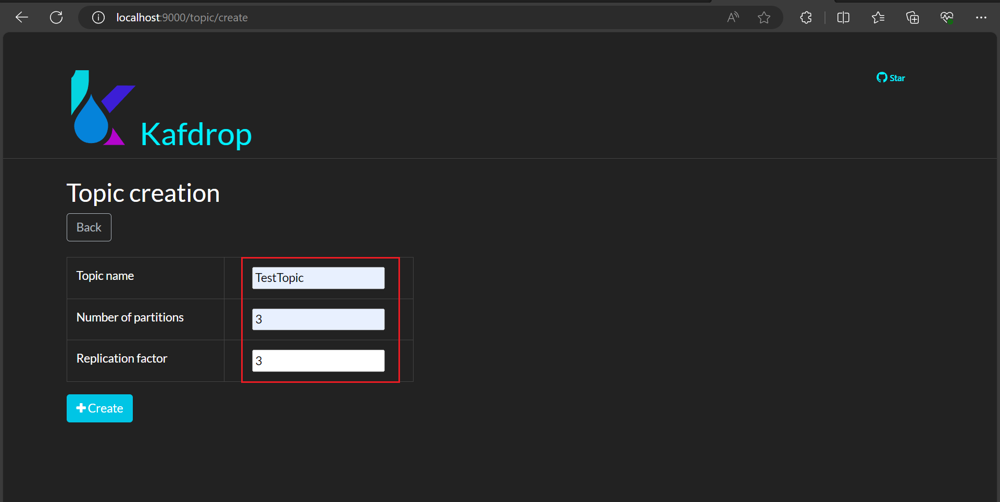
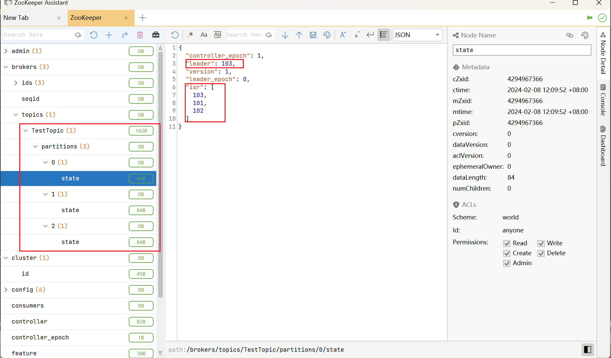
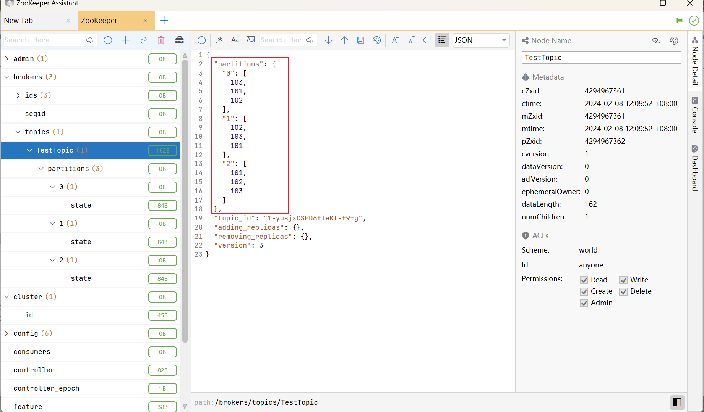

# Kafka 源码分析

## 消费者 提交偏移 源码分析

https://segmentfault.com/a/1190000043775148

## 消费者 拉取消息 源码

```
ConsumerRecords<Integer, String> records = consumer.poll(Duration.ofSeconds(1));
   // 如果需要 更新分配元数据
   updateAssignmentMetadataIfNeeded(timer, false);
   // 拉取数据
   final Fetch<K, V> fetch = pollForFetches(timer);
      // 发送 Fetch
      sendFetches();
         for (Map.Entry<Node, FetchSessionHandler.FetchRequestData> entry : fetchRequestMap.entrySet()) {
            // 创建抓取请求
            final FetchRequest.Builder request = createFetchRequest(fetchTarget, data);
            RequestFutureListener<ClientResponse> listener = new RequestFutureListener<ClientResponse>() {
                @Override
                // 抓取请求成功
                public void onSuccess(ClientResponse resp) {
                    synchronized (Fetcher.this) {
                    。  // 处理抓取的响应 
                        handleFetchResponse(fetchTarget, data, resp);
                           // 获取抓取请求的响应的响应体
                           final FetchResponse response = (FetchResponse) resp.responseBody();
                           // 已完成的抓取
                           CompletedFetch<K, V> completedFetch = new CompletedFetch<>();
                          // 已完成的所有抓取 添加 这个已完成的抓取    
                          completedFetches.add(completedFetch);
                    }
                }

                @Override
                // 抓取请求失败
                public void onFailure(RuntimeException e) {
                    synchronized (Fetcher.this) {
                        handleFetchResponse(fetchTarget, e);
                    }
                }
            };
            // 客户端 发送 拉取数据 请求
            final RequestFuture<ClientResponse> future = client.send(fetchTarget, request);
            // 添加监听器 
            future.addListener(listener);
        }
        // 收集fetch
        return fetcher.collectFetch();
            // 当 记录 剩余数量 大于0 一直处理
            while (recordsRemaining > 0) {
                if (nextInLineFetch == null || nextInLineFetch.isConsumed) {
                    CompletedFetch<K, V> records = completedFetches.peek();
                    // 记录数据为空 直接退出循环
                    if (records == null) break;
                    // 拉取数据
                    completedFetches.poll();
       
                } else {
                    // 拉取记录数据
                    Fetch<K, V> nextFetch = fetchRecords(recordsRemaining);
                    // 记录剩余数 减去 这次拉取的记录数 处理多少减去多少
                    recordsRemaining -= nextFetch.numRecords();
                    fetch.add(nextFetch);
                }
            }
   if (!fetch.isEmpty()) {
        if (fetch.records().isEmpty()) {
        }
        // 拦截器 处理数据
        // 返回拦截器处理后的 数据 
        return this.interceptors.onConsume(new ConsumerRecords<>(fetch.records()));
    }
```

## 消费者 订阅主题 源码

```
consumer.subscribe(Collections.singleton("Users"));
   // 订阅主题
   if (this.subscriptions.subscribe(new HashSet<>(topics), listener))
           // 注册再平衡监听器 (例如消费者组，有消费者退出，触发再平衡)
           registerRebalanceListener(listener);
           // 设置订阅类型
           setSubscriptionType(SubscriptionType.AUTO_TOPICS);
           // 修改订阅 (和以前不一样 返回true)
           return changeSubscription(topics); 
      // 元数据 请求更新 为 新的主题 (如果和以前不一样)
      metadata.requestUpdateForNewTopics();
            
```

## 消费者 创建消费者 源码

```
KafkaConsumer<Integer, String> consumer = new KafkaConsumer<Integer, String>(props);
   // 消费者组再平衡配置
   GroupRebalanceConfig groupRebalanceConfig = new GroupRebalanceConfig(config,
                    GroupRebalanceConfig.ProtocolType.CONSUMER);
   // 消费者组ID
   this.groupId = Optional.ofNullable(groupRebalanceConfig.groupId);
   // 客户端ID
   this.clientId = config.getString(CommonClientConfigs.CLIENT_ID_CONFIG);
   // 请求超时时间 默认30秒 30000 (30 seconds)
   this.requestTimeoutMs = config.getInt(ConsumerConfig.REQUEST_TIMEOUT_MS_CONFIG);
   this.defaultApiTimeoutMs = config.getInt(ConsumerConfig.DEFAULT_API_TIMEOUT_MS_CONFIG);
   // 拦截器列表
   List<ConsumerInterceptor<K, V>> interceptorList = createConsumerInterceptors(config);
   this.interceptors = new ConsumerInterceptors<>(interceptorList);
   // key value 反序列化器
   this.keyDeserializer = createKeyDeserializer(config, keyDeserializer);
   this.valueDeserializer = createValueDeserializer(config, valueDeserializer);
   // 创建订阅状态
   this.subscriptions = createSubscriptionState(config, logContext);
        // 自动偏移重置
        String s = config.getString(ConsumerConfig.AUTO_OFFSET_RESET_CONFIG).toUpperCase(Locale.ROOT);
        // 偏移重置策略
        OffsetResetStrategy strategy = OffsetResetStrategy.valueOf(s);
   // 消费者 元数据
   //    允许自动创建主题 allow.auto.create.topics         true
   //    包括内部主题 !exclude.internal.topics      !true false
   this.metadata = new ConsumerMetadata(config, subscriptions, logContext, clusterResourceListeners);
   // Kafka 集群地址
   List<InetSocketAddress> addresses = ClientUtils.parseAndValidateAddresses(config);
   this.metadata.bootstrap(addresses);
   // 创建消费者网络客户端
   this.client = createConsumerNetworkClient(config,
                       metrics,
                       logContext,
                       apiVersions,
                       time,
                       metadata,
                       fetchMetricsManager.throttleTimeSensor(),
                       retryBackoffMs);  
      // 心跳间隔 heartbeat.interval.ms 3000 (3 seconds)                  
      int heartbeatIntervalMs = config.getInt(ConsumerConfig.HEARTBEAT_INTERVAL_MS_CONFIG);
   // 消费者分区分配器
   this.assignors = ConsumerPartitionAssignor.getAssignorInstances(
           config.getList(ConsumerConfig.PARTITION_ASSIGNMENT_STRATEGY_CONFIG),
           config.originals(Collections.singletonMap(ConsumerConfig.CLIENT_ID_CONFIG, clientId))
   );          
   // 消费者协调器
   //    自动提交 autoCommitEnabled true
   //    自动提交间隔 autoCommitIntevalMs auto.commit.interval.ms 5000 (5 seconds)
   this.coordinator = new ConsumerCoordinator(groupRebalanceConfig,
                        logContext,
                        this.client,
                        assignors,
                        this.metadata,
                        this.subscriptions,
                        metrics,
                        CONSUMER_METRIC_GROUP_PREFIX,
                        this.time,
                        enableAutoCommit,
                        config.getInt(ConsumerConfig.AUTO_COMMIT_INTERVAL_MS_CONFIG),
                        this.interceptors,
                        config.getBoolean(ConsumerConfig.THROW_ON_FETCH_STABLE_OFFSET_UNSUPPORTED),
                        config.getString(ConsumerConfig.CLIENT_RACK_CONFIG));  
    // 创建抓取配置 key value 反序列化器                    
    FetchConfig<K, V> fetchConfig = createFetchConfig(config, this.keyDeserializer, this.valueDeserializer);                                
        // 一次抓取 最小字节数 fetch.min.bytes 1
        this.minBytes = config.getInt(ConsumerConfig.FETCH_MIN_BYTES_CONFIG);
        // 一次抓取 最大字节数 fetch.max.bytes 57671680 (55 mebibytes)
        this.maxBytes = config.getInt(ConsumerConfig.FETCH_MAX_BYTES_CONFIG);
        // 一次抓取 最大等待时间 fetch.max.wait.ms 500毫秒
        this.maxWaitMs = config.getInt(ConsumerConfig.FETCH_MAX_WAIT_MS_CONFIG);
        // 最大分区抓取字节数 max.partition.fetch.bytes 1048576 (1 mebibyte)
        this.fetchSize = config.getInt(ConsumerConfig.MAX_PARTITION_FETCH_BYTES_CONFIG);
        // 一次拉取 最大拉取记录数 max.poll.records 500
        this.maxPollRecords = config.getInt(ConsumerConfig.MAX_POLL_RECORDS_CONFIG);
        this.keyDeserializer = Objects.requireNonNull(keyDeserializer, "Message key deserializer provided to FetchConfig should not be null");
        this.valueDeserializer = Objects.requireNonNull(valueDeserializer, "Message value deserializer provided to FetchConfig should not be null");
    // 数据抓取器                    
    this.fetcher = new Fetcher<>(
                    logContext,
                    this.client,
                    this.metadata,
                    this.subscriptions,
                    fetchConfig,
                    fetchMetricsManager,
                    this.time);                                            
```

## Broker 一条消息 如何接收并写入到磁盘

```
appendRecordsToLeader:1300, Partition (kafka.cluster)
$anonfun$appendToLocalLog$6:1282, ReplicaManager (kafka.server)
apply:-1, ReplicaManager$$Lambda$1494/0x00000008010e5280 (kafka.server)
map:28, StrictOptimizedMapOps (scala.collection)
map$:27, StrictOptimizedMapOps (scala.collection)
map:35, HashMap (scala.collection.mutable)
appendToLocalLog:1270, ReplicaManager (kafka.server)
appendRecords:873, ReplicaManager (kafka.server)
handleProduceRequest:686, KafkaApis (kafka.server)
handle:180, KafkaApis (kafka.server)
run:153, KafkaRequestHandler (kafka.server)
run:833, Thread (java.lang)
```

## Broker 启动 向ZK 注册数据过程

```
core/src/main/scala/kafka/Kafka.scala
kafka.Kafka.main
   // 从参数获取服务器properties
   val serverProps = getPropsFromArgs(args)
   // 创建server对象
   val server = buildServer(serverProps)
   // 启动服务器server
   try server.startup()
      // 初始化zk客户端
      initZkClient(time)
          // 创建zk客户端对象
         _zkClient = KafkaZkClient.createZkClient("Kafka server", time, config, zkClientConfig)
         // 创建顶层路径 这个方法，会把基础的zk路径结构给创建了
         _zkClient.createTopLevelPaths()
   // 获取集群ID 如果没有，则创建一个集群ID 
   // 集群ID生成方式 CoreUtils.generateUuidAsBase64()       
   _clusterId = getOrGenerateClusterId(zkClient)
   // 获取broker id 没有则生成， 如果配置文件有配broker id那么就是那个broker id
   config.brokerId = getOrGenerateBrokerId(preloadedBrokerMetadataCheckpoint)
        
```

## 生产者 获取元数据 继续分析

可以快速 断点到 下面两个位置 快速分析
1. clients.NetworkClient.handleCompletedReceives 的 String source = receive.source();
2. clients.NetworkClient.DefaultMetadataUpdater.handleSuccessfulResponse

最终结论：  
1. 如果填写 localhost:9091,localhost:9092,localhost:9093  
   最终随机取一台，发送请求的node获取集群元数据
2. 如果是后续真正发送消息，会根据元数据，消息具体分区，定位到具体的node节点，  
   会把请求发送到具体的分区leader所在的节点，不会发到follower节点

```
RecordMetadata metadata = producer.send(record).get();
   clusterAndWaitTime = waitOnMetadata(record.topic(), record.partition(), nowMs, maxBlockTimeMs);
      do {
         // 不断 唤醒 sender 线程 让他帮忙获取元数据
         sender.wakeup();       
         metadata.awaitUpdate(version, remainingWaitMs);
     } while (partitionsCount == null || (partition != null && partition >= partitionsCount));

sender线程 第一次 runonce
   client.poll(pollTimeout, currentTimeMs);
      // 元数据更新器 可能更新 传入当前时间戳
      long metadataTimeout = metadataUpdater.maybeUpdate(now);
         // should we update our metadata?
         // 是否需要更新元数据？
         long timeToNextMetadataUpdate = metadata.timeToNextUpdate(now);
         long waitForMetadataFetch = hasFetchInProgress() ? defaultRequestTimeoutMs : 0;
         long metadataTimeout = Math.max(timeToNextMetadataUpdate, waitForMetadataFetch);
         // 不需要更新元数据
         if (metadataTimeout > 0) {
             return metadataTimeout;
         }
         // 选择一个负载最少的node
         Node node = leastLoadedNode(now);
         // 可能更新 传了时间戳和节点
         return maybeUpdate(now, node);
            // 节点连接ID
            String nodeConnectionId = node.idString();
            // 是否节点能够发送请求
            if (canSendRequest(nodeConnectionId, now)) {
                ...
                return defaultRequestTimeoutMs;
            }
            // 是否能够连接
            if (connectionStates.canConnect(nodeConnectionId, now)) {
                // 初始化连接 为了发送 元数据 请求
                log.debug("Initialize connection to node {} for sending metadata request", node);
                initiateConnect(node, now);
                    // 节点连接ID
                    String nodeConnectionId = node.idString();
                    // 连接状态 修改为正在连接
                    connectionStates.connecting(nodeConnectionId, now, node.host());
                    // 连接地址
                    InetAddress address = connectionStates.currentAddress(nodeConnectionId);
                    log.debug("1 {} using address {}", node, address);
                    // 连接节点
                    selector.connect(nodeConnectionId,
                       new InetSocketAddress(address, node.port()),
                       this.socketSendBuffer,
                       this.socketReceiveBuffer);
                       // 创建 socketChannel
                       SocketChannel socketChannel = SocketChannel.open();
                       // 执行连接
                       boolean connected = doConnect(socketChannel, address);
                           // socketChannel 连接 节点
                           return channel.connect(address);
       
                return reconnectBackoffMs;
            }

            // connected, but can't send more OR connecting
            // In either case, we just need to wait for a network event to let us know the selected
            // connection might be usable again.
            return Long.MAX_VALUE;
            
sender线程 第二次 runonce
   client.poll(pollTimeout, currentTimeMs);    
      long metadataTimeout = metadataUpdater.maybeUpdate(now);
         return maybeUpdate(now, node);      
            // 这一次这个节点 可以发送请求了
            if (canSendRequest(nodeConnectionId, now)) {
                Metadata.MetadataRequestAndVersion requestAndVersion = metadata.newMetadataRequestAndVersion(now);
                // 元数据请求 构建器 
                MetadataRequest.Builder metadataRequest = requestAndVersion.requestBuilder;
                // 发送内部的元数据请求
                sendInternalMetadataRequest(metadataRequest, nodeConnectionId, now);
                    // 创建客户端请求
                    ClientRequest clientRequest = newClientRequest(nodeConnectionId, builder, now, true);
                    // 执行发送 第二个参数 是否是内部请求 true
                    doSend(clientRequest, true, now);
                       // 目的地
                       String destination = clientRequest.destination();
                       // 请求头
                       RequestHeader header = clientRequest.makeHeader(request.version());
                       
                       Send send = request.toSend(header);
                       // 正在发送的请求
                       InFlightRequest inFlightRequest = new InFlightRequest(
                               clientRequest,
                               header,
                               isInternalRequest,
                               request,
                               send,
                               now);
                       // 正在发送的所有请求添加该请求        
                       this.inFlightRequests.add(inFlightRequest);
                          // 目的地
                          String destination = request.destination;
                          // 这个目的地 这个节点 的请求队列
                          Deque<NetworkClient.InFlightRequest> reqs = this.requests.get(destination);
                          // 如果这个节点 请求队列为null 创建 并加入到 requests
                          if (reqs == null) {
                              reqs = new ArrayDeque<>();
                              this.requests.put(destination, reqs);
                          }
                          // 这个请求队列，加到最前面
                          reqs.addFirst(request);
                          // 所有正在发送的请求总数+1
                          inFlightRequestCount.incrementAndGet();
                       selector.send(new NetworkSend(clientRequest.destination(), send));
                inProgress = new InProgressData(requestAndVersion.requestVersion, requestAndVersion.isPartialUpdate);
                return defaultRequestTimeoutMs;
            }    
sender线程 第三次 runonce 响应到了
   client.poll(pollTimeout, currentTimeMs);    
     List<ClientResponse> responses = new ArrayList<>();
        handleCompletedSends(responses, updatedNow);
        // 处理完成接收
        handleCompletedReceives(responses, updatedNow);
            // 遍历 请求完成 接收到的数据 一次接收多个请求的结果
            for (NetworkReceive receive : this.selector.completedReceives()) {
               String source = receive.source();
               // 正在发送的请求 完成 该请求
               InFlightRequest req = inFlightRequests.completeNext(source);
               // 解析响应
               AbstractResponse response = parseResponse(receive.payload(), req.header);
               // 如果是内部请求 厄齐尔是 元数据请求
               if (req.isInternalRequest && response instanceof MetadataResponse)
                   // 元数据更新器 处理成功响应
                   metadataUpdater.handleSuccessfulResponse(req.header, now, (MetadataResponse) response);
                         // 元数据 更新
                         this.metadata.update(inProgress.requestVersion, response, inProgress.isPartialUpdate, now);
                              // 缓存 处理元数据响应
                              this.cache = handleMetadataResponse(response, isPartialUpdate, nowMs);

               else if (req.isInternalRequest && response instanceof ApiVersionsResponse)
                   handleApiVersionsResponse(responses, req, now, (ApiVersionsResponse) response);
               // 普通请求
               else
                   responses.add(req.completed(response, now));
           }
        // 处理断开连接
        handleDisconnections(responses, updatedNow);
        // 处理连接
        handleConnections();
        handleInitiateApiVersionRequests(updatedNow);
        // 处理超时连接
        handleTimedOutConnections(responses, updatedNow);
        // 处理超时请求
        handleTimedOutRequests(responses, updatedNow);
        // 完成响应
        completeResponses(responses);           
```

## 源码调试 增加 slf4j 调试 日志输出

```
SLF4J: Failed to load class "org.slf4j.impl.StaticLoggerBinder".
SLF4J: Defaulting to no-operation (NOP) logger implementation
SLF4J: See http://www.slf4j.org/codes.html#StaticLoggerBinder for further details.

1. 
```

## 源码分析 生产者 拉取元数据 过程

```
// 创建生产者
KafkaProducer<Integer, String> producer = new KafkaProducer<>(props);
   // 创建发送器
   //    (class Sender implements Runnable) 发送器是运行对象 线程对象
   //    第二个参数 是kafkaClient 是null 最开始 kafkaClient没有创建 NetworkClient
   this.sender = newSender(logContext, kafkaClient, this.metadata);
      // 如果没有kafkaClient就创建kafkaClient 第一个参数是生产者配置
      KafkaClient client = kafkaClient != null ? kafkaClient : ClientUtils.createNetworkClient(
                producerConfig,
                this.metrics,
                "producer",
                logContext,
                apiVersions,
                time,
                maxInflightRequests,
                metadata,
                throttleTimeSensor);

   // 输入输出线程 KafkaThread对象 
   //    第二个参数是 发送器 会变成 Thread 构造器的 target 参数 运行时会 运行target
   //    (class KafkaThread extends Thread)
   this.ioThread = new KafkaThread(ioThreadName, this.sender, true);
   // 启动io线程，其实是运行 clients.producer.internals.Sender.run()
   this.ioThread.start();
      (ioThread 线程) clients.producer.internals.Sender.run()
        // 主循环 一直运行 直到close关闭被调用 main loop, runs until close is called
        while (running) 
           // 运行一次
           runOnce();
              // 发送生产者数据
              long pollTimeout = sendProducerData(currentTimeMs);
              // 客户端 poll receive 拿到 （应该是响应）
              // 这里的client 是 NetworkClient implements KafkaClient
              // 真正跟Kafka服务端通信的client
              client.poll(pollTimeout, currentTimeMs);

            
// 同步发送
ProducerRecord<Integer, String> record = new ProducerRecord<>("TestTopic", 1,"test 1");
   clusterAndWaitTime = waitOnMetadata(record.topic(), record.partition(), nowMs, maxBlockTimeMs);
      // 去缓存拿集群元数据
      cluster = metadata.fetch();
      // Return cached metadata if we have it, and if the record's partition is either undefined
      // or within the known partition range
      // 满足总分区数不为空 并且 (分区 不为空 或者 分区 小于 总分区数) 直接返回元数据
      // 满足条件 返回集群对象和等待时间
      if (partitionsCount != null && (partition == null || partition < partitionsCount))
            return new ClusterAndWaitTime(cluster, 0);
      // 不断唤醒sender线程 获取集群元数据
      do 循环
         // 元数据 请求更新 为主题 TestTopic 请求更新元数据
         int version = metadata.requestUpdateForTopic(topic);
         sender.wakeup();
         // 元数据 等待更新
         metadata.awaitUpdate(version, remainingWaitMs);
         // 去缓存拿集群元数据
         cluster = metadata.fetch();
      // 满足条件   
      while (partitionsCount == null || (partition != null && partition >= partitionsCount));
      // 返回集群对象和等待时间
      return new ClusterAndWaitTime(cluster, elapsed);
```

## 源码分析 生产者 BOOTSTRAP_SERVERS 提供三个，会选择那个去连接Kafka

SimpleProducer.java

BOOTSTRAP_SERVERS_CONFIG：
   use for establishing the initial connection to the Kafka cluster  
   用来建立连接Kafka集群的初始连接，
   this list only impacts the initial hosts used to discover the full set of servers.
   这个列表仅仅影响需要的初始主机列表，为了发现完整的Kafka Servers服务器列表
```
props.put(ProducerConfig.BOOTSTRAP_SERVERS_CONFIG, "localhost:9091,localhost:9092,localhost:9093");
// 创建生产者
KafkaProducer<Integer, String> producer = new KafkaProducer<>(props);
   // 把Properties转成Map
   this(Utils.propsToMap(properties), keySerializer, valueSerializer);
   // 创建ProducerConfig对象，生产者配置对象 其中configs是上面的Map对象
   this(new ProducerConfig(ProducerConfig.appendSerializerToConfig(configs, keySerializer, valueSerializer)),
                keySerializer, valueSerializer, null, null, null, Time.SYSTEM);
   this.producerConfig = config;
      // 这个ProducerConfig对象的values是HashMap里面有各种配置数据
      producerConfig.values."bootstrap.servers"
         ArrayList(localhost:9091,localhost:9092,localhost:9093)        
   // 把localhost:9091,localhost:9092,localhost:9093转成了InetSocketAddress列表 size=3
   // 网络套接字地址列表       
   List<InetSocketAddress> addresses = ClientUtils.parseAndValidateAddresses(config); 
   // 元数据 bootstrap  /ˈbuːt.stræp/
   this.metadata.bootstrap(addresses);     
      // 缓存 元数据缓存 bootstrap
      this.cache = MetadataCache.bootstrap(addresses);    
         // 节点Map，遍历地址，生成初始的节点对象 nodeId -1 -2 -3 
         Map<Integer, Node> nodes = new HashMap<>();
         int nodeId = -1;
         for (InetSocketAddress address : addresses) {
            nodes.put(nodeId, new Node(nodeId, address.getHostString(), address.getPort()));
            nodeId--;
         } 
   this.sender = newSender(logContext, kafkaClient, this.metadata);
      // 如果没有kafkaClient就创建kafkaClient 第一个参数是生产者配置
      KafkaClient client = kafkaClient != null ? kafkaClient : ClientUtils.createNetworkClient(
                producerConfig,
                this.metrics,
                "producer",
                logContext,
                apiVersions,
                time,
                maxInflightRequests,
                metadata,
                throttleTimeSensor);
   this.ioThread.start();
      (ioThread 线程) clients.producer.internals.Sender.run()
        while (running) 
           runOnce();
              // 可能发送 并且 获取 事务 请求
              maybeSendAndPollTransactionalRequest()
                 // 目标节点 走client.leastLoadedNode(time.milliseconds());
                 // 客户端 最小 负载 的节点 (所有Node中负载最小的那一个。这里的负载最小是通过每个Node在InFlightRequests中还未确认的请求决定的，未确认的请求越多则认为负载越大。)
                 targetNode = coordinatorType != null ? transactionManager.coordinator(coordinatorType) : client.leastLoadedNode(time.milliseconds());
                    int inflight = Integer.MAX_VALUE;
                    Node foundConnecting = null;
                    Node foundCanConnect = null;
                    Node foundReady = null;
                    // 元数据更新器 获取所有节点
                    // 获取的是cluster对象的nodes属性，在cluster初始化的时候，nodes的顺序会被打乱
                    // common.Cluster.Cluster(java.lang.String, boolean, java.util.Collection<org.apache.kafka.common.Node>, java.util.Collection<org.apache.kafka.common.PartitionInfo>, java.util.Set<java.lang.String>, java.util.Set<java.lang.String>, java.util.Set<java.lang.String>, org.apache.kafka.common.Node, java.util.Map<java.lang.String,org.apache.kafka.common.Uuid>)
                    //     // make a randomized, unmodifiable copy of the nodes
                    //     List<Node> copy = new ArrayList<>(nodes);
                    //     Collections.shuffle(copy);
                    //     this.nodes = Collections.unmodifiableList(copy);
                    List<Node> nodes = this.metadataUpdater.fetchNodes();
                    // 获取 0 1 2 随机整数，每次都可能随机，不一样
                    int offset = this.randOffset.nextInt(nodes.size());
                    // 遍历所有节点 i 0 1 2
                    for (int i = 0; i < nodes.size(); i++) {
                        // 随机的offset + 递增的i 模以 3 
                        int idx = (offset + i) % nodes.size();
                        // 随机取到的一个节点
                        Node node = nodes.get(idx);
                        // 是否能发送请求
                        if (canSendRequest(node.idString(), now)) {
                            // inFlistRequests的数量
                            int currInflight = this.inFlightRequests.count(node.idString());
                            // 能发请求 inFlightRequests 为0，负载最小，直接返回
                            if (currInflight == 0) {
                                return node;
                            // inFlightRequests 小于 最小记录 则修改inflight的值并找到准备好的节点   
                            } else if (currInflight < inflight) {
                                inflight = currInflight;
                                foundReady = node;
                            }
                        // 连接状态 是否准备连接 如果是 找到正在连接的节点    
                        } else if (connectionStates.isPreparingConnection(node.idString())) {
                            foundConnecting = node;
                        // 是否可以连接    
                        } else if (canConnect(node, now)) {
                            // 如果找到可以连接为null或者 或者 ... 记录找到可以连接的节点
                            if (foundCanConnect == null ||
                                    this.connectionStates.lastConnectAttemptMs(foundCanConnect.idString()) >
                                            this.connectionStates.lastConnectAttemptMs(node.idString())) {
                                foundCanConnect = node;
                            }
                        } else {
                            log.trace("Removing node {} from least loaded node selection since it is neither ready " +
                                    "for sending or connecting", node);
                        }
                    // 如果找到准备好的 直接返回    
                    if (foundReady != null) {
                        return foundReady;
                    // 如果找到正在连接的 直接返回    
                    } else if (foundConnecting != null) {
                        return foundConnecting;
                    // 如果找到可以连接 直接返回    
                    } else if (foundCanConnect != null) {
                        return foundCanConnect;
                    } else {
                        return null;
                    }
                // 等待节点准备好 有等待超时    
                if (!awaitNodeReady(targetNode, coordinatorType)) {
             long currentTimeMs = time.milliseconds();
             // 发送生产者数据
             long pollTimeout = sendProducerData(currentTimeMs);
                // 准备好的所有节点一直都是一个 103 因为 key = 1 时 partition = 0   "leader": 103,
                // 客户端会直接发往leader分区的那个节点，不会发往follower分区的节点
                // 如果再加一条发送，key = 2 partition = 2 "leader": 101
                // 这时候可以看到，最开始是只有 103，后面只有101，说明客户端确实会根据具体的分区leader去发数据
                Iterator<Node> iter = result.readyNodes.iterator();
             client.poll(pollTimeout, currentTimeMs);  
// 同步发送           
ProducerRecord<Integer, String> record = new ProducerRecord<>("TestTopic", 1,"test 1");
  
```

## 源码分析 发送一条消息 到 TestTopic(3分区 3副本) 指定 Key 生产者源码

SimpleProducer.java

```
// 没用控制器节点Node连接Kafka 控制器节点是localhost:9092
props.put(ProducerConfig.BOOTSTRAP_SERVERS_CONFIG, "localhost:9091");
// 创建生产者
KafkaProducer<Integer, String> producer = new KafkaProducer<>(props);
// 同步发送
ProducerRecord<Integer, String> record = new ProducerRecord<>("TestTopic", 1,"test 1");
RecordMetadata metadata = producer.send(record).get();
   // 拦截器链 /ˌɪn.təˈsep.tər/
   ProducerRecord<K, V> interceptedRecord = this.interceptors.onSend(record);
      // 遍历拦截器 每个拦截器 进行拦截一次
      for (ProducerInterceptor<K, V> interceptor : this.interceptors) {                       
         interceptRecord = interceptor.onSend(interceptRecord);
      }
   // 执行发送 第一个参数 拦截后的记录 第二个参数 回调
   doSend(interceptedRecord, callback);
      // 获取clusterAndWaitTime对象 里面有cluster集群对象 保存整个集群信息 等待元数据 
      // 第一个参数 主题 TestTopic 第二个参数 分区 null
      clusterAndWaitTime = waitOnMetadata(record.topic(), record.partition(), nowMs, maxBlockTimeMs);
          // 可能会一开始拿不到数据
          Cluster(
            id = jCuC3DfhTzGo9pn8yF5l8Q, 
            // 节点列表 (不管客户端连接那个节点，最终都会拿到所有节点)
            nodes = [localhost:9091 (id: 101 rack: null), localhost:9092 (id: 102 rack: null), localhost:9093 (id: 103 rack: null)],
            // 分区列表  
            //    TestTopic 分区0 分区1  分区2 
            partitions = [
            Partition(topic = TestTopic, partition = 1, leader = 102, replicas = [102,103,101], isr = [102,103,101], offlineReplicas = []), 
            Partition(topic = TestTopic, partition = 2, leader = 101, replicas = [101,102,103], isr = [101,102,103], offlineReplicas = []),
            Partition(topic = TestTopic, partition = 0, leader = 103, replicas = [103,101,102], isr = [103,101,102], offlineReplicas = [])
            ], 
            // 集群控制器
            controller = localhost:9092 (id: 102 rack: null)
        )
```

## 源码 集群 搭建 一台 Windows 三个节点 3.6.1

1. 启动zookeeper集群 端口 2181 2182 2183
2. 复制server.properties，生成三份配置
```
-- server101.properties (这里不用1 2 3是为了调试时方便看日志) --
broker.id=101 (另外两个分别为102 103)
listeners=PLAINTEXT://localhost:9091 (另外两个分别为9092 9093 默认是9092)
advertised.listeners=PLAINTEXT://localhost:9091 (好像又不需要配，否则报警告，WARN [Controller id=101, targetBrokerId=102] Connection to node 102 (localhost/127.0.0.1:9092) could not be established. Broker may not be available. 另外两个分别为9092 9093 默认是9092)

log.dirs=kfdata101 (另外两个分别为 102 103)

zookeeper.connect=localhost:2181,localhost:2182,localhost:2183
zookeeper.connection.timeout.ms=18000

num.network.threads=3
num.io.threads=8
socket.send.buffer.bytes=102400
socket.receive.buffer.bytes=102400
socket.request.max.bytes=104857600

num.partitions=1
num.recovery.threads.per.data.dir=1

offsets.topic.replication.factor=1

transaction.state.log.replication.factor=1
transaction.state.log.min.isr=1

log.retention.hours=168
log.retention.check.interval.ms=300000

group.initial.rebalance.delay.ms=0
```
3. 运行配置 添加 Kafka101 Kafka102 Kafka103，参数修改为 config/server101.properties 102 103
4. 分别启动 Kafka101 Kafka102 Kafka103
```
-------- 启动Kafka101，发现zk多了很多数据，其中 --------
   brokers/ids/101 
   {
     "features": {},
     "listener_security_protocol_map": {
       "PLAINTEXT": "PLAINTEXT"
     },
     "endpoints": [
       "PLAINTEXT://localhost:9091"
     ],
     "jmx_port": -1,
     "port": 9091,
     "host": "localhost",
     "version": 5,
     "timestamp": "1707276552023"
   }
然后，第一台还抢到了controler的位置，毕竟只有一台
   /controller
   {
     "version": 2,
     "brokerid": 101,
     "timestamp": "1707276552920",
     "kraftControllerEpoch": -1
   }
-------- 启动 Kafka 102 --------  
Recorded new controller, from now on will use node localhost:9091 (id: 101 rack: null) 
表示101是控制器，会使用localhost:9091作为控制器
101控制器感知到了102的启动
ZK多了一些数据，例如/brokers/ids/102
   {
     "features": {},
     "listener_security_protocol_map": {
       "PLAINTEXT": "PLAINTEXT"
     },
     "endpoints": [
       "PLAINTEXT://localhost:9092"
     ],
     "jmx_port": -1,
     "port": 9092,
     "host": "localhost",
     "version": 5,
     "timestamp": "1707276714549"
   }
-------- 启动 Kafka 103 ----------
Recorded new controller, from now on will use node localhost:9091 (id: 101 rack: null)
表示控制器是101
101控制器感知到了103的启动
zk上多了些数据 
   /brokers/ids/103
   {
     "features": {},
     "listener_security_protocol_map": {
       "PLAINTEXT": "PLAINTEXT"
     },
     "endpoints": [
       "PLAINTEXT://localhost:9093"
     ],
     "jmx_port": -1,
     "port": 9093,
     "host": "localhost",
     "version": 5,
     "timestamp": "1707277233529"
   }  
```
5. 可视化工具 `D:\java\jdk-17.0.4.1\bin\java.exe --add-opens=java.base/sun.nio.ch=ALL-UNNAMED -jar kafdrop-4.0.1.jar --kafka.brokerConnect=localhost:9091,localhost:9092,localhost:9093`
6. 创建主题 TestTopic，分区3，每个分区3个副本，副本因子3 (1个leader 2个follower)





zk上多了/brokders/topics/TestTopic
```
{
  "partitions": {
    "0": [
      103,
      101,
      102
    ],
    "1": [
      102,
      103,
      101
    ],
    "2": [
      101,
      102,
      103
    ]
  },
  "topic_id": "1-yusjxCSPO6fTeKl-f9fg",
  "adding_replicas": {},
  "removing_replicas": {},
  "version": 3
}
```





7. 关闭101，controller节点，过一段时间后，大概10几秒
```
zk上控制器，变成102
/controller
{
  "version": 2,
  "brokerid": 102,
  "timestamp": "1707278204217",
  "kraftControllerEpoch": -1
}
brokers/ids/101，这个节点被删除
```
8. 再次启动101
```
Recorded new controller, from now on will use node localhost:9092 (id: 102 rack: null) 
表示控制器变102
brokers/ids/101数据恢复
```


## Kafka Knowledge

https://www.processon.com/view/5f3e9546f346fb06ded2fdc4

# 集群 搭建 三台 3.6.1

Kafka 2.8.0 以后支持使用新的 Raft 模式搭建集群，开始逐渐放弃 ZooKeeper  
据说 Kafka 4.0 将完全放弃 ZooKeeper  
以下使用 Kafka 3.6.1 自带的 ZooKeeper 进行搭建

步骤参考网络，即使实践过，也不一定准确，具体还得参考官网描述，

1. jdk 17 三台机器 /software/jdk
2. kafka 3.6.1 三台机器 /software/kafka
3. 环境变量 三台机器  
   vim /etc/profile  
   export PATH="$PATH:/software/jdk/bin:/software/kafka/bin"  
   source /etc/profile
4. 修改 zookeeper.properties    
```
# dataDir=/tmp/zookeeper  
dataDir=/software/kafka/zkdata

initLimit=20 (需要，否则启动zk报错 Caused by: java.lang.IllegalArgumentException: initLimit is not set)
syncLimit=10 (没有会报错 Caused by: java.lang.IllegalArgumentException: syncLimit is not set)

server.201=192.168.1.201:2888:3888  
server.202=192.168.1.202:2888:3888  
server.203=192.168.1.203:2888:3888 
```
    
5. 在 zkdata 里面创建 myid，并写入id  
   mkdir zkdata
   echo 201 > myid (另两台分别为 202 203)  
6. 配置 Kafka server.properties  
```
# borker.id=0  
broker.id=201 (另两台分别为 202 203)    

# log.dirs=/tmp/kafka-logs    
log.dirs=/software/kafka/data  

# zookeeper.connect=localhost:2181    
zookeeper.connect=192.168.1.201:2181,192.168.1.202:2181,192.168.1.203:2181    

#listeners=PLAINTEXT://:9092
listeners:PLAINTEXT://192.168.1.201:9092 (另两台分别为202 203)
(必须，否则后续使用会出现 Request processing failed: kafdrop.service.KafkaAdminClientException: java.util.concurrent.ExecutionException: org.apache.kafka.common.errors.TimeoutException: Timed out waiting for a node assignment. Call: listNodes)
```
7. 三台机器 启动 zk
```shell
$ zookeeper-server-start.sh
USAGE: /software/kafka/bin/zookeeper-server-start.sh [-daemon] zookeeper.properties
$ (先调试一台机器) zookeeper-server-start.sh /software/kafka/config/zookeeper.properties
$ (调试三台机器) zookeeper-server-start.sh /software/kafka/config/zookeeper.properties
$ (没问题后，三台机器) zookeeper-server-start.sh -daemon /software/kafka/config/zookeeper.properties
日志在 zookeeper.out，看看有没报错
```
8. 三台集群 启动 kafka
```shell
$ kafka-server-start.sh 
USAGE: /software/kafka/bin/kafka-server-start.sh [-daemon] server.properties [--override property=value]*
$ (直接三台调试) kafka-server-start.sh /software/kafka/config/server.properties 
$ (没问题后，三台后台启动) kafka-server-start.sh -daemon /software/kafka/config/server.properties 
日志在 server.log 
tail -f server.log
```
9. 使用可视化工具 kafdrop 看看集群状况
```
(可 Windows 操作，用 jdk-17)
> D:\java\jdk-17.0.4.1\bin\java.exe --add-opens=java.base/sun.nio.ch=ALL-UNNAMED -jar kafdrop-4.0.1.jar --kafka.brokerConnect=192.168.1.201:9092,192.168.1.202:9092,192.168.1.203:9092
访问  http://localhost:9000
能在Web UI上看到三台broker
```

  


## 源码分析 Broker 启动过程 (部分内容来自网络，可能不正确)

```
启动类 kafka.Kafka (Kafka.scala)

入口 Kafka.scala#main()

主要三步：
1. Kafka.scala#getPropsFromArgs() 将启动参数指定配置文件加载到内存
2. Kafka.scala#buildServer() 创建 Kafka Server 
  2.1 将内存中的配置，转化为 KafkaConfig对象
  2.2 KafkaConfig.scala#requiresZookeeper() 确定 Kafka的启动模式，raft or zk
      通过process.roles配置的存在与否来判断
  2.3 kafka 3.0 KRaft支持已经比较稳定，走 raft 模式，会创建 KafkaRaftServer 
    2.3.1 broker BrokerServer对象
    2.3.2 controler ControlerServer对象，用来处理元数据类请求，包含topic创建删除等
    2.3.3 raftManager KafkaRaftManager对象，负责集选举及元数据同步的组件
3. Server.scala#startup() 启动 Kafka Server
    网络通讯相关的 
      SocketServer 底层网络服务器的创建及配置启动
      KafkaRequestHandlerPool 上层请求处理器池的创建启动
    3.1 KafkaScheduler 对象， 定时任务线程池
    3.2 KRaftMetadataCache 集群元数据管理组件
    3.3 BrokerToControllerChannelManager broker到controller的连接管理器
    3.4 forwardingManager 转发应该由controller处理的请求
    3.5 socketServer 底层网络服务器
    3.6 _replicaManager 副本管理器，负责消息的存储读取
    3.7 metadataListerner 元数据监听对象，会注册到KafkaRaftManager中监听集群元数据变化
    3.8 groupCoordinator 普通消费者组协调器，负责辅助完成消费组内各个消费者消费分区的协调分配
    3.9 dataPlaneRequestProcessor KafkaApis对象，上层的请求处理器，持有底层网络服务器的请求队列socketServer.dataPlaneRequestChannel
        负责从队列中取出请求进行处理
    3.10 dataPlaneRequestHandlerPool KafkaRequestHandlerPool 请求处理线程池        
```

```
Kafka 新建立连接、请求处理
1. Acceptor连接接收器启动后，SocketServer.scala#Acceptor#run()
    1.1 serverChannel.register() ServerSocketChannel Selector 监听事件 SelectionKey.OP_ACCEP
    1.2 死循环 SocketServer.scala#Acceptor#acceptNewConnections() 接受远端连接
    1.3 新连接 丢到 对应的 新建连接队列 processor去处理
2. SocketServer.scala#Processor#processNewResponses()
3. SocketServer.scala#Processor#processCompletedReceives()
```


```
      if (canStartup) {
        _brokerState = BrokerState.STARTING

        /* setup zookeeper */
        // 初始化Zk客户端
        initZkClient(time)
        
          private def initZkClient(time: Time): Unit = {
    info(s"Connecting to zookeeper on ${config.zkConnect} 连接zookeeper...............")
    // config.zkConnect 是 localhost:2181
    // 创建zk客户端
    _zkClient = KafkaZkClient.createZkClient("Kafka server", time, config, zkClientConfig)
    // 创建顶级路径
    _zkClient.createTopLevelPaths()
  }

```


```
        /* start scheduler */
        // 创建并开始定时任务
        kafkaScheduler = new KafkaScheduler(config.backgroundThreads)
        kafkaScheduler.startup()
```


```
KafkaServer里面有很多重要的属性，各个组件，
例如socketServer，replicaManager 副本管理器、kafkaController 集群管理器，groupCoordinator，LogManager ，
kafkaScheduler 定时器，zkClient，transactionCoordinator 事务协调器等

1. 每个Broker都有一个controller，主要负责管理整个集群，
但每个集群中，只有一个Leader的controller有资格管理集群
2. leader controller 借助 zookeeper 选出来的，
每个controller初始化时，都会向zk注册leader路径的监听，
第一个成功写入zk的controller会成为leader，其他controller会收到新leader的通知，
将自己设为follower
3. 当controller成为leader时，会像zk注册相关监听
4. leader controller 会监听集群数据变化，如增加topic partition replica等
当监听到数据变化leader controller会得到zk的通知，并处理，
处理完后，同步相关数据给其他follower controller
5. controller leader 负责管理整个集群中分区和副本的状态
```

```
Broker 层次，分Leader和Follower
Replica 层次，也分Leader和Follower
Zookeeper 集群，也分Leader和Follower

Broker 启动时，会去ZK中创建/controller节点，
第一个成功创建/controller节点的Broker会被指定为Controller
（单机版时，没看到这个节点，版本不一样？还是需要集群才行？）
假设Broker 0是控制器，broker 0宕机，zk watch机制感知到，删除/controller临时节点
之后，其他存活broker竞选，假设broker 3最终赢得选举，
成功在zk重建/controoler节点，之后，
broker 3会从zk读取集群元数据，并初始化到自己的内存缓存中
控制器failover完成
```


## 监控平台 可视化工具  

有很多监控平台，例如 

1. Kafka Eagle (最后一次提交 5 months ago)
2. Kafka Center
3. Xinfra Monitor (LinkedIn)
4. Kafdrop (Apache 2.0 许可项目，作为一款 Apache Kafka Web UI 可视化工具 ) (最后一次提交 last week)
5. Logi-KafkaManager
6. Kafka Manager (更名为CMAK) (Yahoo) （最后一次提交 2 years ago）

等等...

http://www.kafka-eagle.org/
https://github.com/yahoo/CMAK  
https://github.com/obsidiandynamics/kafdrop  

kafdrop 启动 `java --add-opens=java.base/sun.nio.ch=ALL-UNNAMED \
-jar target/kafdrop-<version>.jar \
--kafka.brokerConnect=<host:port,host:port>,...`

## 调试生产者

```
> .\kafka-console-producer.bat
Missing required option(s) [bootstrap-server]
Option                                   Description
------                                   -----------
--bootstrap-server <String: server to    REQUIRED unless --broker-list
  connect to>                              (deprecated) is specified. The server
                                           (s) to connect to. The broker list
                                           string in the form HOST1:PORT1,HOST2:
                                           PORT2.
--broker-list <String: broker-list>      DEPRECATED, use --bootstrap-server
                                           instead; ignored if --bootstrap-
                                           server is specified.  The broker
                                           list string in the form HOST1:PORT1,
                                           HOST2:PORT2.
--topic <String: topic>                  REQUIRED: The topic id to produce
                                           messages to.
--version                                Display Kafka version.
```

```
> .\kafka-console-producer.bat  --bootstrap-server 192.168.1.103:9092 --topic TopicTest
>test01
>test02
>test03
```

## 调试消费者

```

> kafka-console-consumer.bat
This tool helps to read data from Kafka topics and outputs it to standard output.
Option                                   Description
------                                   -----------
--bootstrap-server <String: server to    REQUIRED: The server(s) to connect to.
  connect to>
--from-beginning                         If the consumer does not already have
                                           an established offset to consume
                                           from, start with the earliest
                                           message present in the log rather
                                           than the latest message.
--group <String: consumer group id>      The consumer group id of the consumer.
--topic <String: topic>                  The topic to consume on.
--version                                Display Kafka version.
```

```
>kafka-console-consumer.bat  --bootstrap-server 192.168.1.103:9092 --topic TopicTest
test01
test02
test03
```

## 调试主题 增删改查

https://kafka.apache.org/documentation/#basic_ops

下载对应版本的 二进制 包

常用操作如下

```
[D:\kafka\kafka_2.13-3.6.1\bin\windows]$ kafka-topics.bat
Create, delete, describe, or change a topic.
Option                                   Description                            
------                                   -----------                            
--alter                                  Alter the number of partitions and     
                                           replica assignment. Update the       
                                           configuration of an existing topic   
                                           via --alter is no longer supported   
                                           here (the kafka-configs CLI supports 
                                           altering topic configs with a --     
                                           bootstrap-server option).            
--bootstrap-server <String: server to    REQUIRED: The Kafka server to connect  
  connect to>                              to.                                                         
--create                                 Create a new topic.                    
--delete                                 Delete a topic                         
--describe                               List details for the given topics.                           
--help                                   Print usage information.                  
--list                                   List all available topics.             
--partitions <Integer: # of partitions>  The number of partitions for the topic 
                                           being created or altered (WARNING:   
                                           If partitions are increased for a    
                                           topic that has a key, the partition  
                                           logic or ordering of the messages    
                                           will be affected). If not supplied   
                                           for create, defaults to the cluster  
                                           default.                                                                 
--replication-factor <Integer:           The replication factor for each        
  replication factor>                      partition in the topic being         
                                           created. If not supplied, defaults   
                                           to the cluster default.              
--topic <String: topic>                  The topic to create, alter, describe   
                                           or delete. It also accepts a regular 
                                           expression, except for --create      
                                           option. Put topic name in double     
                                           quotes and use the '\' prefix to     
                                           escape regular expression symbols; e.
                                           g. "test\.topic".                                                                
--version                                Display Kafka version.      
```

具体操作

```
> kafka-topics.bat --bootstrap-server 192.168.1.103:9092 --list


> kafka-topics.bat --bootstrap-server 192.168.1.103:9092 --create --topic TopicTest
Created topic TopicTest.

> kafka-topics.bat --bootstrap-server 192.168.1.103:9092 --create --topic TopicTest2
Created topic TopicTest2.

> kafka-topics.bat --bootstrap-server 192.168.1.103:9092 --list
TopicTest
TopicTest2

> kafka-topics.bat --bootstrap-server 192.168.1.103:9092 --describe --topic TopicTest
Topic: TopicTest	TopicId: TVn4roHhSGCu_wuxT_gD_w	PartitionCount: 1	ReplicationFactor: 1 Configs: 
	Topic: TopicTest	Partition: 0	Leader: 0	Replicas: 0	Isr: 0

> kafka-topics.bat --bootstrap-server 192.168.1.103:9092 --alter --topic TopicTest2 --partitions 2

> kafka-topics.bat --bootstrap-server 192.168.1.103:9092 --describe --topic TopicTest2
Topic: TopicTest2	TopicId: uy8MesrQSoWtCpNl-P8CWQ	PartitionCount: 2	ReplicationFactor: 1 Configs: 
	Topic: TopicTest2	Partition: 0	Leader: 0	Replicas: 0	Isr: 0
	Topic: TopicTest2	Partition: 1	Leader: 0	Replicas: 0	Isr: 0

> kafka-topics.bat --bootstrap-server 192.168.1.103:9092 --delete --topic TopicTest2
```

## 源码编译

修改 数据目录，很重要，方便后期调试

```
config/server.properties
修改
# log.dirs=/tmp/kafka-logs
log.dirs=E:\\java-project\\kafka-source-code-analysis\\kafka-3.6.1-src\\kafka-logs
注意 \ 要改成 \\

或者
# 表示工作目录下的 kafka-logs，运行配置有配置当前工作目录，目录可以不存在
log.dirs=kafka-logs
```

问题一 Gradle 下载 Connect time out 

问题二 可能 Scala 环境没弄好

    gradle.properties 有 Scala 的版本
    scalaVersion=2.13.11
    安装 Scala 插件和SDK，
        插件到设置里面搜索Scala下载，
        SDK访问kafka-3.6.1-src/core/src/main/scala/kafka/Kafka.scala，
        上方出现 No Scala Module in module，点击Setup Scala SDK，
            这个插件不仅仅有语法提示而且可以帮你下载 Scala SDK，切换 SDK 非常方便
        也可以手动下载Scala SDK，然后指定一下SDK位置
        https://scala-lang.org/download/ 点击 PICK SPECIAL RELEASE -> 找到 2.13.11 -> 下载 Windows 压缩包

问题三 运行 Kafka


问题四 Failed to load class org.slf4j.impl.StaticLoggerBinder

    build.gradle 

    // 原来的 testImplementation libs.slf4jlog4j
    implementation libs.slf4jlog4j

    刷新项目 sync 项目

问题五 log4j:WARN No appenders could be found for logger (kafka.utils.Log4jControllerRegistration$).

    把config/log4j.properties复制一份到
    core/src/main/resources
    
问题四 > Process 'command 'D:\java\jdk-17.0.4.1\bin\java.exe'' finished with non-zero exit value 1

    操作问题四、问题五
    很重要，不然运行时看不到运行日志和错误日志

    [2024-01-24 12:16:54,099] INFO Opening socket connection to server localhost/127.0.0.1:2181. (org.apache.zookeeper.ClientCnxn)
    ...
    [2024-01-24 12:16:55,340] ERROR Exiting Kafka due to fatal exception during startup. (kafka.Kafka$)
    kafka.zookeeper.ZooKeeperClientTimeoutException: Timed out waiting for connection while in state: CONNECTING

    原因 没启动 ZooKeeper

    解决办法

    下载ZooKeeper源码，调试，启动，然后运行Kafka，成功

问题六 ERROR Shutdown broker because all log dirs in ... have failed (kafka.log.LogManager)

```
据说 操作Topic时，Windows 才会出现这个问题

貌似做topic的删除操作就会出现，尽量不做删除topic操作

解决办法
1. 停掉 Kafka，删除数据目录 kafka-logs
2. 停掉 ZooKeeper，删除数据目录 zookeeper_data
3. 启动 ZooKeeper，启动 Kafka
问题解决
```

## 为什么 Kafka 不用 Netty

*来自网络*

```
上篇文章我们讲述到，我们的 producer 会将消息发送至 RecordAccumulator 中，然后启动 Sender 线程
我们大概率可以猜测到，我们的 Sender 线程是和我们的 Broker 进行通信的，提到通信，不得不说一下 Netty
大家都知道，Netty 是一个优秀的 I/O 框架，但 Kafka 在通信方面并没有采用 Netty，让人比较难以理解
当然，博主也查到了关于 kafka 开发者的回答：

一共两个原因：
1、由于性能问题，kafka 的通信过程并不需要 netty 那么庞大的通信体系
2、kafka客户端原始时期，需要让用户将整个东西作为依赖项包含其内，如果引入了 netty，那么每个人依赖的版本号不同，将会产生巨大的兼容问题
3、kafka的安全层和一些另外的问题，需要 kafka 自己来解决，而这些烦恼的问题，netty 中已经解决了
博主感觉，极大概率由于历史原因，现在就算换成 netty，一些代码也不容易重构，更何况现在 kafka 自研的 I/O 通信模型反响还可以，所以 kafka 一直都没使用 netty 的想法。
```

## Basic

1. 一个主题，每个分区里面能保证队列有序，不同分区不能保证顺序
2. 如果分区数量大于，一个消费者组里面的消费者数量，那么会有一个消费者负责消费多个分区，涉及分区消费策略
3. kafka-console-consumer不指定消费者组时，每次执行都是随机的不同的消费者组
4. 每个分区里面，涉及生产偏移量，消费偏移量，对于消费偏移量，每个消费者组都在这个分区维护有各自的消费偏移量
5. 比较经典的部署，就是3台机器，每个消费者组，3个消费者 
6. 命令行客户端、图形界面客户端、代码客户端
7. 分区、副本，其实对应的就是一个相应的文件夹
8. 删除主题时，修改相应的数据文件夹的名字，标记为删除，等时机到了，就会删除，这样性能高，机器资源利用率好
9. 新的消费者组，默认从主题的末尾开始消费，也就是不消费之前的数据
10. 旧的消费者组，如果下线，kafka记录它之前消费到的偏移量，重新上线后，会在之前下线的位置开始消费消息
11. 消息数据使用分层存储，一个主题有多个分区，一个分区有多个log文件，log文件里面记录消息实际的数据，由于每个消息可能字节数不同，索引起来很慢，所以每个log文件都有一个index文件，专门用来做索引，记录消息id和该消息的偏移量，结构使用数组结构，每条消息的索引字节数一样，所以很容易找到具体数据，然后索引文件index里面的数据是提前生成好的，这样的好处是方便直接插入，而log文件的数据是慢慢追加的
12. 有index，有log文件，主要是为了考虑性能，需要那块数据，加载那块数据的index和log即可，也可高效利用内存
13. log和index叫做segment 分片
14. kafka-clients 默认的消费者，是异步发送消息，有main线程、sender线程，异步发送消息，可以配置batch.size、linger.time，满足batch.size会发送，或者满足linger.time也会发送，这个涉及批量发送的优化，据说linger.time默认为0ms，这些都给优化，如果需要
15. 源码结构貌似比RocketMQ整洁
16. 生产者，发送消息，一般经过 拦截器、序列化器（键、值序列化器）、分区器
17. 生产消息默认异步，还可以添加回调函数，使用Future可以实现同步发送
18. 分区策略；如果发送时可以指定分区，或者提供Key，那么会根据Key的Hash模分区总数后，得到分区，或者不填分区不填Key，那么会根据粘性分区缓存，会一批一批发送数据
19. 默认使用默认分区器，可以自己实现分区器接口，并自定义分区规则
20. Kafka有REST API，虽然性能要低，但各个语言都能用
21. 生产者 ack 策略 0 1 -1，不同的策略性能不同，可能会导致消息丢失、消息重复
22. 生产者生产消息相关的事务、消费者消费消息相关的事务
23. 保证消息不丢失、不重复；生产者默认开启幂等性校验
24. 磁盘随机读写 100K/s，顺序读写 600M/s，零拷贝，页缓存，JVM外内存

## 其他

大神们的命名习惯各不相同，不需要太在意 例如配置目录 conf config ... 

影响速度的四个因素 CPU > 内存 > 磁盘 > 网络

## 主题、分区、副本

一个主题有一个或多个分区，为了负载均衡，提高性能，多个分区需要分布在不同机器上；一个分区有一个或多个副本，为了避免单点故障，副本必须在其他机器上。

每个分区只能被一个消费者组里面的一个消费者消费，不能被一个消费组里面的多个消费者同时消费，避免同一个消费者组重复消费相同消息。

## Kafka Streams 简介

*From Internet*

```
1、Kafka Stream背景
    1.1 Kafka Stream是什么
    1.2 什么是流式计算
    1.3 为什么要有Kafka Stream
2、Kafka Stream如何解决流式系统中关键问题
    2.1 KTable和KSteam
    2.2 时间
    2.3 窗口
3、Kafka Stream应用示例
    3.1 案例一：将topicA的数据写入到topicB中(纯复制)
    3.2 案例二：将TopicA中的数据实现wordcount写入到TopicB
    3.3 示例三：在TopicA中每输入一个值求和并写入到TopicB
    3.4 案例四：窗口
        3.4.1 每隔2秒钟输出一次过去5秒内topicA里的wordcount，结果写入到TopicB
        3.4.2 每隔5秒钟输出一次过去5秒内topicA里的wordcount，结果写入到TopicB
        3.4.3 TopicA 15秒内的wordcount，结果写入TopicB
    3.5 案例五：将TopicA的某一列扁平化处理写入TopicB
    3.6 案例六：将TopicA的多列扁平化处理写入TopicB

1.1 Kafka Stream是什么
Kafka Streams是一套客户端类库，它可以对存储在Kafka内的数据进行流式处理和分析。
1.2 什么是流式计算
流式计算：输入是持续的，一般先定义目标计算，然后数据到来之后将计算逻辑应用于数据，往往用增量计算代替全量计算。
批量计算：一般先有全量数据集，然后定义计算逻辑，并将计算应用于全量数据。特点是全量计算，并且计算结果一次性全量输出。
1.3 为什么要有Kafka Stream
开源流式处理系统有：Spark Streaming和Apache Storm，它们能与SQL处理集成等优点，功能强大，那为何还需要Kafka Stream呢？
1、使用方便。Spark和Storm都是流式处理框架，而Kafka Stream是基于Kafka的流式处理类库。开发者很难了解框架的具体运行方式，调试成本高，使用受限。而类库直接提供具体的类给开发者使用，整个应用的运行方式主要由开发者控制，方便使用和调试。
2、使用成本低。就流式处理系统而言，基本都支持Kafka作为数据源。Kafka基本上是主流的流式处理系统的标准数据源。大部分流式系统中都部署了Kafka，包括Spark和Storm，此时使用Kafka Stream的成本非常低。
3、省资源。使用Storm或Spark Streaming时，需要为框架本身的进程预留资源，框架本身也占资源。
4、Kafka本身也有优点。由于Kafka Consumer Rebalance机制，Kafka Stream可以在线动态调整并发度。
```

## Kafka KRaft

Raft一种共识技术，Paxos也是，KRaft 使用了 Raft 共识算法的一种基于事件的变体，因此得名。

/rɑːft/

```
当今互联网中的每一个系统，都可以看作是分布式系统的一种形式。
虽然大多数系统不需要任何形式的分布式状态或者副本——因为这会增加复杂性、运维支持成本，并影响系统交付的质量，但在需要实现高可用性等情况下，就必须采用分布式状态或副本。然而，构建一个容错和快速的分布式系统是极具挑战性的。
"...容错性方案基本都是主备。所有的数据流都经过主节点，并由主节点在备份到备节点。当主节点宕机时，切换到备节点继续处理。这不是很好的做法。
共识技术已经存在很长时间了，它们赋予我们在市场中达成共识和正确容错的能力。Paxos可能是最著名的，但是很难实现和正确使用。然后 Raft 论文的发表改变了人们对此的看法。因为 Raft 有个有趣的目标，是建立一个易于理解的共识算法，而不是建立一个完美的算法。这是个巨大的革新。"
——著名高性能专家 Martin Thompson（Dirsuptor和SBE等作者）在2020 Qcon演讲中提到
```

## Kafka Connect 简介

Kafka Connect 是一种用于在 Apache Kafka 和其他系统之间可扩展且可靠地流式传输数据的工具。 它使快速定义将大量数据移入和移出 Kafka 的连接器变得简单。 Kafka Connect 可以摄取整个数据库或从所有应用程序服务器收集指标到 Kafka 主题中，使数据可用于低延迟的流处理。 导出作业可以将数据从 Kafka 主题传送到二级存储和查询系统或批处理系统进行离线分析。

Kafka Connect是一个用于数据导入和导出的工具。  
它能够把多种数据源（如MySQL，HDFS等）与Kafka之间进行连接，实现数据在不同系统之间的交互以及数据的流动。

## 文档链接

https://kafka.apache.org/documentation/

## 源码链接

https://github.com/apache/kafka

## 官网

https://kafka.apache.org/  
https://www.scala-lang.org/

## 简介

最初 LinkedIn /lɪŋktˈɪn/ 领英 开发 -> 后来 成为 Apache 软件基金会 项目 

开发语言主要是 Java 和 Scala /ˈskɑːlə, ˈskeɪlə/ 

Scala 运行于 Java 平台（Java虚拟机），并兼容现有的 Java 程序

Kafka /ˈkɑːfkə/ 名字来自 团队成员 Kreps 喜欢的一个作家的名字 - 弗朗茨·卡夫卡 Franz Kafka

LinkedIn 2016被 Microsoft 微软 收购

Kafka 中文名 卡夫卡

目前 超过 80% 的财富 100 强公司 信任并使用 Kafka。

10/10最大的保险公司  
10/10最大的制造公司  
10/10最大的信息技术和服务公司  
8/10最大的电信公司  
8/10最大的运输公司  
7/10最大的零售公司  
7/10最大的银行和金融公司  
6/10最大的能源和公用事业组织  

Zookeeper  /ˈzuːˌkiː.pər/